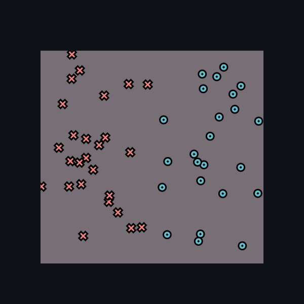
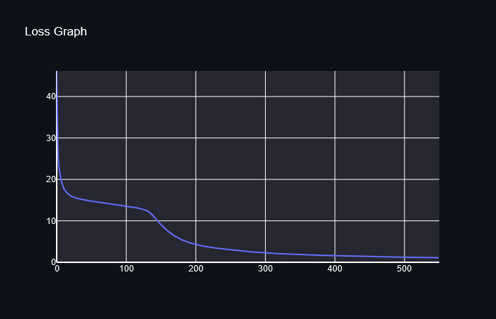

[](https://classroom.github.com/a/YFgwt0yY)
# MiniTorch Module 2


* Docs: https://minitorch.github.io/

* Overview: https://minitorch.github.io/module2/module2/

This assignment requires the following files from the previous assignments. You can get these by running

```bash
python sync_previous_module.py previous-module-dir current-module-dir
```

The files that will be synced are:

        minitorch/operators.py minitorch/module.py minitorch/autodiff.py minitorch/scalar.py minitorch/scalar_functions.py minitorch/module.py project/run_manual.py project/run_scalar.py project/datasets.py




Plot info:
- Dataset: simple
- Number of points: 50
- Learning rate: 1.0
- Number of Epochs: 500
- Time per epoch: ~0.191s
- Hidden layers: 4
Log:
Epoch: 10/500, loss: 34.65716980026385, correct: 26
Epoch: 20/500, loss: 34.61737580974537, correct: 26
Epoch: 30/500, loss: 34.61724876301484, correct: 26
Epoch: 40/500, loss: 34.61724835590714, correct: 26
Epoch: 50/500, loss: 34.61724835460229, correct: 26
Epoch: 60/500, loss: 34.61724835459809, correct: 26
Epoch: 70/500, loss: 34.61724835459807, correct: 26
Epoch: 80/500, loss: 34.61724835459809, correct: 26
Epoch: 90/500, loss: 34.61724835459806, correct: 26
Epoch: 100/500, loss: 34.61724835459804, correct: 26
Epoch: 110/500, loss: 34.61724835459804, correct: 26
Epoch: 120/500, loss: 34.61724835459807, correct: 26
Epoch: 130/500, loss: 34.61724835459807, correct: 26
Epoch: 140/500, loss: 34.61724835459807, correct: 26
Epoch: 150/500, loss: 34.61724835459807, correct: 26
Epoch: 160/500, loss: 34.61724835459807, correct: 26
Epoch: 170/500, loss: 34.61724835459807, correct: 26
Epoch: 180/500, loss: 34.61724835459807, correct: 26
Epoch: 190/500, loss: 34.61724835459807, correct: 26
Epoch: 200/500, loss: 34.61724835459807, correct: 26
Epoch: 210/500, loss: 34.61724835459807, correct: 26
Epoch: 220/500, loss: 34.61724835459807, correct: 26
Epoch: 230/500, loss: 34.61724835459807, correct: 26
Epoch: 240/500, loss: 34.61724835459807, correct: 26
Epoch: 250/500, loss: 34.61724835459807, correct: 26
Epoch: 260/500, loss: 34.61724835459807, correct: 26
Epoch: 270/500, loss: 34.61724835459807, correct: 26
Epoch: 280/500, loss: 34.61724835459807, correct: 26
Epoch: 290/500, loss: 34.61724835459807, correct: 26
Epoch: 300/500, loss: 34.61724835459807, correct: 26
Epoch: 310/500, loss: 34.61724835459807, correct: 26
Epoch: 320/500, loss: 34.61724835459807, correct: 26
Epoch: 330/500, loss: 34.61724835459807, correct: 26
Epoch: 340/500, loss: 34.61724835459807, correct: 26
Epoch: 350/500, loss: 34.61724835459807, correct: 26
Epoch: 360/500, loss: 34.61724835459807, correct: 26
Epoch: 370/500, loss: 34.61724835459807, correct: 26
Epoch: 380/500, loss: 34.61724835459807, correct: 26
Epoch: 390/500, loss: 34.61724835459807, correct: 26
Epoch: 400/500, loss: 34.61724835459807, correct: 26
Epoch: 410/500, loss: 34.61724835459807, correct: 26
Epoch: 420/500, loss: 34.61724835459807, correct: 26
Epoch: 430/500, loss: 34.61724835459807, correct: 26
Epoch: 440/500, loss: 34.61724835459807, correct: 26
Epoch: 450/500, loss: 34.61724835459807, correct: 26
Epoch: 460/500, loss: 34.61724835459807, correct: 26
Epoch: 470/500, loss: 34.61724835459807, correct: 26
Epoch: 480/500, loss: 34.61724835459807, correct: 26
Epoch: 490/500, loss: 34.61724835459807, correct: 26
Epoch: 500/500, loss: 34.61724835459807, correct: 26




Plot info:
- Dataset: diag
- Number of points: 50
- Learning rate: 0.5
- Number of Epochs: 550
- Time per epoch: ~0.275s
- Hidden layers: 5
Log:
Epoch: 10/550, loss: 18.31502914990637, correct: 45
Epoch: 20/550, loss: 16.145759688122773, correct: 45
Epoch: 30/550, loss: 15.449638031051546, correct: 45
Epoch: 40/550, loss: 15.070135808951756, correct: 45
Epoch: 50/550, loss: 14.776561183371829, correct: 45
Epoch: 60/550, loss: 14.518256318149106, correct: 45
Epoch: 70/550, loss: 14.285197752226429, correct: 45
Epoch: 80/550, loss: 14.062097818449148, correct: 45
Epoch: 90/550, loss: 13.833875606769919, correct: 45
Epoch: 100/550, loss: 13.600295941609454, correct: 45
Epoch: 110/550, loss: 13.364837982388245, correct: 45
Epoch: 120/550, loss: 13.003448350533693, correct: 45
Epoch: 130/550, loss: 12.528158203491618, correct: 45
Epoch: 140/550, loss: 11.126686300116384, correct: 45
Epoch: 150/550, loss: 9.253658508916056, correct: 46
Epoch: 160/550, loss: 7.6458328566684495, correct: 48
Epoch: 170/550, loss: 6.4116807094023684, correct: 49
Epoch: 180/550, loss: 5.490381975017012, correct: 49
Epoch: 190/550, loss: 4.836427121310093, correct: 49
Epoch: 200/550, loss: 4.338738523186127, correct: 49
Epoch: 210/550, loss: 3.953171376543764, correct: 49
Epoch: 220/550, loss: 3.6581026354049064, correct: 49
Epoch: 230/550, loss: 3.4204854553074866, correct: 49
Epoch: 240/550, loss: 3.22681921034783, correct: 49
Epoch: 250/550, loss: 3.050579483612357, correct: 49
Epoch: 260/550, loss: 2.8530025817126865, correct: 49
Epoch: 270/550, loss: 2.6728968868054266, correct: 49
Epoch: 280/550, loss: 2.5157011652059835, correct: 49
Epoch: 290/550, loss: 2.3864381348524097, correct: 49
Epoch: 300/550, loss: 2.2701490257528842, correct: 49
Epoch: 310/550, loss: 2.16830423251879, correct: 49
Epoch: 320/550, loss: 2.0805133214008213, correct: 49
Epoch: 330/550, loss: 2.001084791206789, correct: 49
Epoch: 340/550, loss: 1.9280780882695963, correct: 49
Epoch: 350/550, loss: 1.86058567043659, correct: 49
Epoch: 360/550, loss: 1.7987552869271084, correct: 49
Epoch: 370/550, loss: 1.7415016456691248, correct: 49
Epoch: 380/550, loss: 1.6881971707014345, correct: 50
Epoch: 390/550, loss: 1.6382425292616496, correct: 50
Epoch: 400/550, loss: 1.590403160814374, correct: 50
Epoch: 410/550, loss: 1.546096943904806, correct: 50
Epoch: 420/550, loss: 1.503517325514866, correct: 50
Epoch: 430/550, loss: 1.4630480671285362, correct: 50
Epoch: 440/550, loss: 1.424677475604108, correct: 50
Epoch: 450/550, loss: 1.3868065257543343, correct: 50
Epoch: 460/550, loss: 1.351324181503114, correct: 50
Epoch: 470/550, loss: 1.3187822338636856, correct: 50
Epoch: 480/550, loss: 1.2861973767246335, correct: 50
Epoch: 490/550, loss: 1.2547844659519622, correct: 50
Epoch: 500/550, loss: 1.2248959410143228, correct: 50
Epoch: 510/550, loss: 1.1956456570836367, correct: 50
Epoch: 520/550, loss: 1.1681364184093996, correct: 50
Epoch: 530/550, loss: 1.1510195278268203, correct: 50
Epoch: 540/550, loss: 1.1275373922067948, correct: 50
Epoch: 550/550, loss: 1.1035539021618226, correct: 50


Plot info:
- Dataset: split
- Number of points: 50
- Learning rate: 0.5
- Number of Epochs: 525
- Time per epoch: 0.297s
- Hidden layers: 3
Log:
Epoch: 10/525, loss: 34.61915548206087, correct: 27
Epoch: 20/525, loss: 34.431008885531035, correct: 27
Epoch: 30/525, loss: 34.40613155831295, correct: 27
Epoch: 40/525, loss: 34.39542887314933, correct: 27
Epoch: 50/525, loss: 34.38750398068155, correct: 27
Epoch: 60/525, loss: 34.38088404036035, correct: 27
Epoch: 70/525, loss: 34.372879380072675, correct: 27
Epoch: 80/525, loss: 34.3648290500933, correct: 27
Epoch: 90/525, loss: 34.35166536776795, correct: 27
Epoch: 100/525, loss: 34.33698355910174, correct: 27
Epoch: 110/525, loss: 34.31326773624226, correct: 27
Epoch: 120/525, loss: 34.268420161034676, correct: 27
Epoch: 130/525, loss: 34.215471284194145, correct: 27
Epoch: 140/525, loss: 34.19029846810457, correct: 27
Epoch: 150/525, loss: 34.176360301507394, correct: 29
Epoch: 160/525, loss: 34.16295735823799, correct: 29
Epoch: 170/525, loss: 34.14985358150654, correct: 29
Epoch: 180/525, loss: 34.13624408603296, correct: 29
Epoch: 190/525, loss: 34.12302206240486, correct: 29
Epoch: 200/525, loss: 34.10947023562848, correct: 29
Epoch: 210/525, loss: 34.09594405001665, correct: 29
Epoch: 220/525, loss: 34.08247524133047, correct: 29
Epoch: 230/525, loss: 34.068872523279005, correct: 29
Epoch: 240/525, loss: 34.05567984913543, correct: 29
Epoch: 250/525, loss: 34.042299633693645, correct: 30
Epoch: 260/525, loss: 34.02916695462902, correct: 30
Epoch: 270/525, loss: 34.01553689804421, correct: 31
Epoch: 280/525, loss: 34.0021755009626, correct: 31
Epoch: 290/525, loss: 33.989177352690284, correct: 31
Epoch: 300/525, loss: 33.975896332088524, correct: 31
Epoch: 310/525, loss: 33.963074607342946, correct: 31
Epoch: 320/525, loss: 33.94969567270403, correct: 31
Epoch: 330/525, loss: 33.936649025254255, correct: 31
Epoch: 340/525, loss: 33.92482454314576, correct: 29
Epoch: 350/525, loss: 33.91031638961375, correct: 29
Epoch: 360/525, loss: 33.89639442466777, correct: 29
Epoch: 370/525, loss: 33.8831248429301, correct: 29
Epoch: 380/525, loss: 33.87020538196643, correct: 29
Epoch: 390/525, loss: 33.85639506317571, correct: 30
Epoch: 400/525, loss: 33.84271841636703, correct: 30
Epoch: 410/525, loss: 33.82929212972852, correct: 30
Epoch: 420/525, loss: 33.81564133883906, correct: 30
Epoch: 430/525, loss: 33.802434834099934, correct: 30
Epoch: 440/525, loss: 33.78875078205764, correct: 30
Epoch: 450/525, loss: 33.775549815865986, correct: 30
Epoch: 460/525, loss: 33.7621244061013, correct: 30
Epoch: 470/525, loss: 33.74925064180239, correct: 30
Epoch: 480/525, loss: 33.73567222287604, correct: 30
Epoch: 490/525, loss: 33.72300998947083, correct: 30
Epoch: 500/525, loss: 33.709747938773845, correct: 30
Epoch: 510/525, loss: 33.69677948644482, correct: 30
Epoch: 520/525, loss: 33.68394321987886, correct: 30
Epoch: 525/525, loss: 33.677342913765266, correct: 30


Plot info:
- Dataset: xor
- Number of points: 50
- Learning rate: 1.0
- Number of Epochs: 450
- Time per epoch: ~1.125s
- Hidden layers: 10
Log:
Epoch: 10/450, loss: 34.50981280440612, correct: 27
Epoch: 20/450, loss: 34.49712981048405, correct: 27
Epoch: 30/450, loss: 34.49708806159665, correct: 27
Epoch: 40/450, loss: 34.497087923478574, correct: 27
Epoch: 50/450, loss: 34.49708792302148, correct: 27
Epoch: 60/450, loss: 34.49708792301995, correct: 27
Epoch: 70/450, loss: 34.49708792301999, correct: 27
Epoch: 80/450, loss: 34.49708792301996, correct: 27
Epoch: 90/450, loss: 34.497087923019976, correct: 27
Epoch: 100/450, loss: 34.497087923019976, correct: 27
Epoch: 110/450, loss: 34.49708792301999, correct: 27
Epoch: 120/450, loss: 34.49708792301999, correct: 27
Epoch: 130/450, loss: 34.49708792301995, correct: 27
Epoch: 140/450, loss: 34.49708792301995, correct: 27
Epoch: 150/450, loss: 34.49708792301995, correct: 27
Epoch: 160/450, loss: 34.49708792301995, correct: 27
Epoch: 170/450, loss: 34.49708792301995, correct: 27
Epoch: 180/450, loss: 34.49708792301995, correct: 27
Epoch: 190/450, loss: 34.49708792301995, correct: 27
Epoch: 200/450, loss: 34.49708792301995, correct: 27
Epoch: 210/450, loss: 34.49708792301995, correct: 27
Epoch: 220/450, loss: 34.49708792301995, correct: 27
Epoch: 230/450, loss: 34.49708792301995, correct: 27
Epoch: 240/450, loss: 34.49708792301995, correct: 27
Epoch: 250/450, loss: 34.49708792301995, correct: 27
Epoch: 260/450, loss: 34.49708792301995, correct: 27
Epoch: 270/450, loss: 34.49708792301995, correct: 27
Epoch: 280/450, loss: 34.49708792301995, correct: 27
Epoch: 290/450, loss: 34.49708792301995, correct: 27
Epoch: 300/450, loss: 34.49708792301995, correct: 27
Epoch: 310/450, loss: 34.49708792301995, correct: 27
Epoch: 320/450, loss: 34.49708792301995, correct: 27
Epoch: 330/450, loss: 34.49708792301995, correct: 27
Epoch: 340/450, loss: 34.49708792301995, correct: 27
Epoch: 350/450, loss: 34.49708792301995, correct: 27
Epoch: 360/450, loss: 34.49708792301995, correct: 27
Epoch: 370/450, loss: 34.49708792301995, correct: 27
Epoch: 380/450, loss: 34.49708792301995, correct: 27
Epoch: 390/450, loss: 34.49708792301995, correct: 27
Epoch: 400/450, loss: 34.49708792301995, correct: 27
Epoch: 410/450, loss: 34.49708792301995, correct: 27
Epoch: 420/450, loss: 34.49708792301995, correct: 27
Epoch: 430/450, loss: 34.49708792301995, correct: 27
Epoch: 440/450, loss: 34.49708792301995, correct: 27
Epoch: 450/450, loss: 34.49708792301995, correct: 27